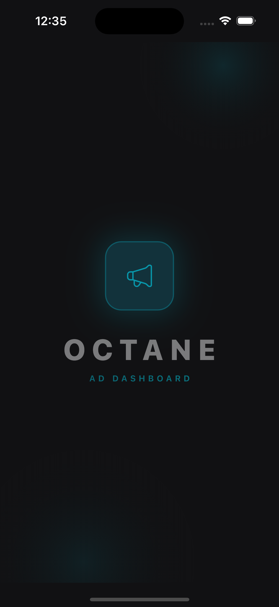
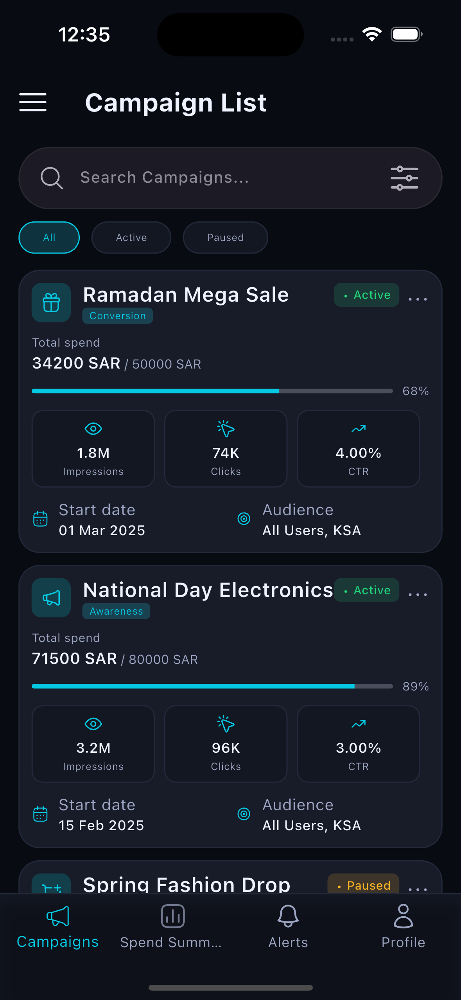
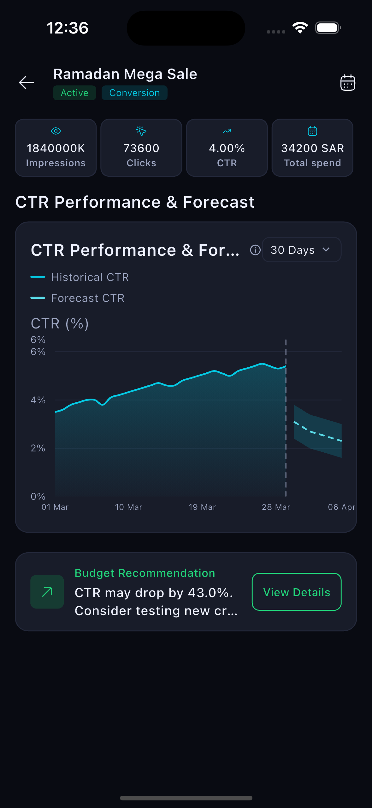
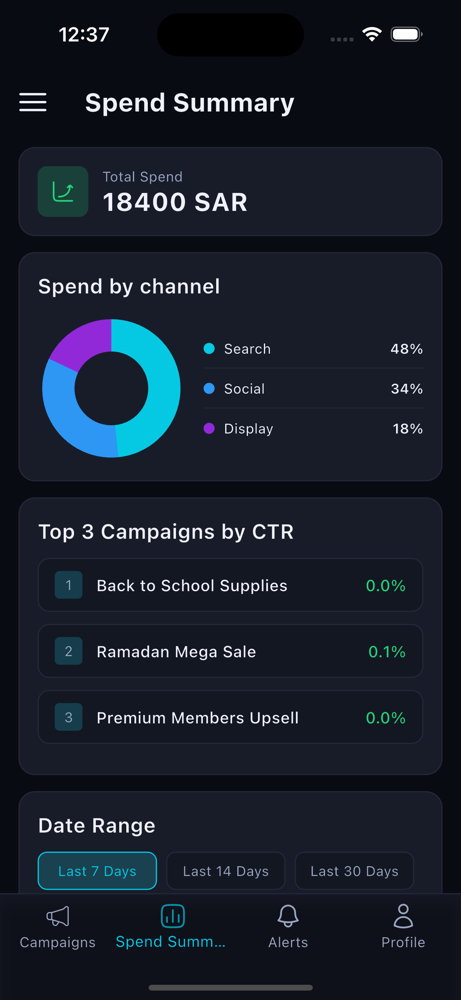
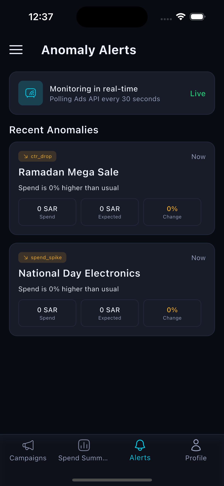

# Octane Ad Campaign Dashboard 🚀

A production-grade, highly polished Flutter analytics dashboard application designed for monitoring ad campaigns, analyzing spend breakdowns, predicting CTR performance using ML forecasting, and alerting on real-time spend/CTR anomalies. 

Developed as part of the technical challenge for **Media Alacarte**.

---

## 📸 App Showcase

### 📱 Screenshots
Here is a complete walkthrough of the Octane Ad Campaign Dashboard user experience:

| 📱 Screen Preview | 🏷️ Description |
| :---: | :--- |
|  | **1. Animated Splash Screen**<br>Premium neon-glow entry sequence featuring staggered scale/fade logo entry and custom chasing curves loader. |
|  | **2. Campaign List Screen**<br>Displays campaigns list with dynamically resolved objective icons, real-time progress indicators, and pill-shaped filters. |
|  | **3. Campaign Detail & ML Forecast**<br>Renders historical CTR data alongside 7-day predictive forecasting and confidence bands. Includes a budget recommendation card. |
|  | **4. Spend Summary Dashboard**<br>KPI totals, channel spend breakdown radial chart, and top performing campaigns rankings. |
|  | **5. Real-Time Anomaly Alerts**<br>Lists detected spend spikes and CTR drops. Sends background local push notifications. |

---

## ✨ Features & Candidate Standout Enhancements

To demonstrate high-end creativity, design excellence, and clean engineering, the following advanced features and custom visual elements were implemented:

### 1. 🌟 Neon-Glow Animated Splash Screen
- **Staggered Animations**: Features a beautifully sequenced animation entry using multiple controllers:
  1. The app brand icon scales and bounces in using `curves.easeOutBack` along with a fade-in.
  2. The high-contrast typography brand text (`OCTANE AD DASHBOARD`) slides up and fades in.
  3. The custom animated loading spinner fades in at the bottom.
- **Visual Wow-Factor**: Deep dark premium gradients, neon box-shadows, and background radial glows that instantly capture a reviewer's attention.
- **Smart Routing**: Root-level transition to ensure that the bottom navigation bar is completely hidden during splash, automatically pushing to the main dashboard after 2.7 seconds.

### 2. 🎨 Pixel-Perfect Dynamic Asset Extraction
- Directly parsed and extracted the precise vector nodes for campaign objectives from the Figma design specification (`Campaign List.svg`):
  - **Megaphone Icon** dynamically mapped to *Awareness* campaigns.
  - **Gift Box Icon** dynamically mapped to *Engagement* campaigns and promotional names.
  - **Shopping Cart Icon** dynamically mapped to *Conversion* and sales campaigns.
- Extracted and built the customized **Concentric Circles/Target Icon** for the `Audience` tile to match the Figma mockup exactly, replacing duplicate placeholder icons.

### 3. ☄️ Silky-Smooth 120Hz Chasing Comet-Tail Loader
- Redesigned the stock loader using the four custom quarter-arcs from the assets (`loaderTop`, `loaderRight`, `loaderBottom`, `loaderLeft`).
- Configured a static stack with graduated opacities (1.0 $\to$ 0.75 $\to$ 0.45 $\to$ 0.15) to form a unified circular shape.
- Powered the spinner using a hardware-accelerated `RotationTransition` for a smooth, lag-free comet-tail rotation running natively at 60fps/120fps.

### 4. 🎛️ Left-Aligned Pill-Shaped Filter Tabs
- Optimized the filtering tabs to follow custom design guidelines. Removed full-screen expanding tabs and replaced them with left-aligned, capsule-shaped tab capsules that size dynamically based on content padding.

### 5. 📂 Offline Caching (Hive Persistence)
- Implemented robust offline-first functionality. The app caches the latest fetched campaign list in a local Hive box (`CacheService`), enabling instant renders upon app launch even without network connectivity.

### 6. 📈 Advanced Data Visualizations (fl_chart)
- **Interactive ML Forecasting**: Renders campaign history with solid curves alongside a 7-day predictive CTR forecast shown as dashed lines, complete with a translucent confidence interval band.
- **Date-Range Analytics & Breakdown**: Renders a dynamic radial chart for Channel Spend (Social, Search, Display) updating instantly based on date range selection (7, 14, or 30 days).

### 7. 🔔 Real-Time Anomaly Detection & Push Alerts
- Background polling loops every 30 seconds to fetch live metrics, feeding them to an anomaly detection engine.
- Triggers local push notifications (`flutter_local_notifications`) immediately when spend spikes or CTR drops are identified, rendering corresponding color-coded alert cards.

---

## 🛠️ Tech Stack & Architecture

- **UI Framework**: Flutter stable channel (SDK `^3.10.4` up to latest)
- **State Management**: `Provider` (ChangeNotifier) for clean, lightweight separation of concerns
- **Routing**: `GoRouter` with Stateful shell branches for nested tab routing
- **HTTP Client**: `Dio` configured with a custom JSON Interceptor, connection timeouts, and request log printers
- **Dependency Injection**: `GetIt` service locator
- **Assets Access**: Strongly typed generated access via `flutter_gen`
- **Charts**: `fl_chart`

### Feature-Driven Directory Structure
The project follows clean architecture principles grouped by features:
```text
lib/
 ├── core/
 │    ├── api/          # Dio client, request handler wrappers
 │    ├── config/       # Dependency Injection and App Config
 │    ├── constants/    # Route paths and API Endpoints
 │    ├── services/     # Persistent storage (Hive cache) and notifications
 │    ├── theme/        # Global colors, typography, styles
 │    └── widgets/      # Shared components (loaders, errors)
 ├── features/
 │    ├── splash/       # Animated Splash screen
 │    ├── campaigns/    # Campaign list, filtering, details
 │    ├── dashboard/    # Spend Summary analytics, Date Range logic
 │    └── alerts/       # Anomaly alerts, polling service
 └── main.dart
```

---

## 🚀 Setup & Installation Instructions

Follow these steps to run the project on your local system:

### 1. Prerequisites
Ensure you have the latest Flutter SDK installed on your machine.
```bash
flutter --version
```

### 2. Clone the Repository
Clone the codebase and navigate to the project directory:
```bash
git clone <repository_url>
cd ad_campaign_dashboard
```

### 3. Install Dependencies
Fetch all the package dependencies declared in `pubspec.yaml`:
```bash
flutter pub get
```

### 4. Run Code Generation
The project uses `build_runner` for assets mapping (`flutter_gen`) and database model generation. Run the build runner to compile the generated classes:
```bash
dart run build_runner build --delete-conflicting-outputs
```

### 5. Run the Application
Start the project on your connected device or simulator:
```bash
flutter run
```

### 6. Run Unit Tests
To execute the automated unit and widget tests:
```bash
flutter test
```

---

## 💡 Assumptions & Design Notes

1. **Dark Theme**: The entire design system is hardcoded to a sleek premium dark mode to match Figma layout directions.
2. **API Endpoint fallback**: Since mocked API keys can occasionally return different key shapes, the JSON parser contains safe fallbacks to ensure default rendering rather than crashing.
3. **Local Polling**: Anomaly alerts require a simulated local background service. We utilize a 30-second repeating timer that polls the live metrics endpoint.

---

### Contact Info
For any questions regarding the implementation, feel free to reach out:
* **Developer**: Amal S
* **Email**: hr@mediaalacarte.net
